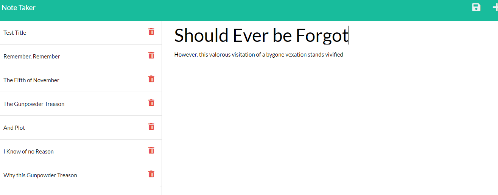

# Note to Self

  

  

  ## Description
  This application allows the user to create and save notes consisting of a title and a body.  The saved notes can be accessed by clicking on the note title (that note will become the active note), and the notes can be deleted when no longer needed.
  
  ## Link
  Awaiting Heroku Address
  
  ## Table of Contents
  
  * [Installation](#installation)
  * [Usage](#usage)
  * [License](#license)
  * [Contributing](#contributing)
  * [Tests](#tests)
  * [Questions](#questions)
  
  ## Installation
  
  The application requires that the associated Git repository files be cloned.  Node.js is necessary on the machine to run the program, and the packages express and uuid must be installed for the application to function properly.
  
  ## Usage
  
  This application is a front-end application that can either be run locally on the user's machine or from a hosted server (like Heroku).  Once the html document is accessed, the user can create and delete notes as desired.
  
  ## License
  
  The content of this project is licensed under the [MIT License](https://opensource.org/licenses/MIT).  Please click [here](https://opensource.org/licenses/MIT) for more information about how you may use code in this project.

  ## Contributing

  There is not much left to be done on this project (and the project is fairly derivative of many other projects).  However, should some other developer have ideas about improving/expanding the project, he or she is more than welcome to contact me at the email address below.
  
  
  ## Tests
  
  This particular project did not utilize any specific testing during development.
  
  ## Questions
  [GitHub Profile](http://github.com/cabralwilliams)
  
  For any questions concerning this application, please contact me at cabral.williams@gmail.com.